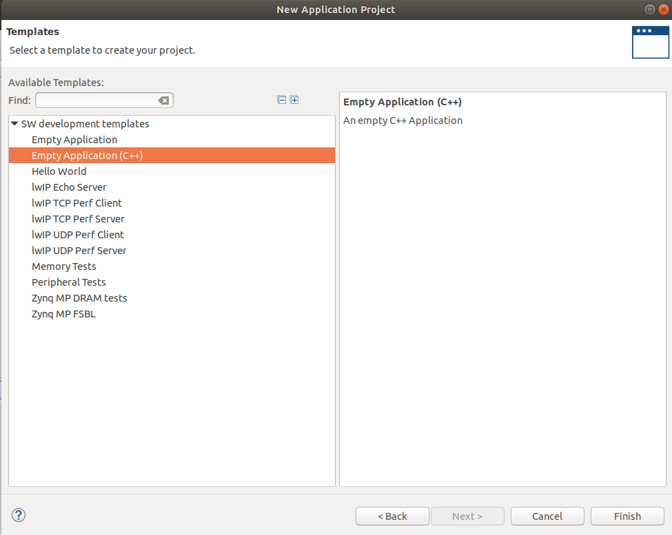

# DIRC based on PicoRV32
This is a temporary repo for DIRC with [picorv32](https://github.com/cliffordwolf/picorv32) support.


## 1 Tool Setup

### 1.1 Vitis Preparation
The demo is developed with [Vitis 2020.1](https://www.xilinx.com/support/download/index.html/content/xilinx/en/downloadNav/vivado-design-tools/2020-1.html) 
and [Ultra96v2 board](https://www.96boards.org/product/ultra96/).
The default Vitis does not include Ultra96v2 BSP. You can copy the dir **ultra96v2**
under [BSP](./BSP) to \<Vitis Installation DIR\>/Vivado/2020.1/data/boards/board_files.

### 1.2 RISC-V Tool Praparation

The RISC-V toolchain is based on picorv32 repo. You can install the RISC-V toolchain with 
this commit tag (411d134).
We copy the installation guide from [picorv32](https://github.com/cliffordwolf/picorv32) 
as below.

    # Ubuntu packages needed:
    sudo apt-get install autoconf automake autotools-dev curl libmpc-dev \
            libmpfr-dev libgmp-dev gawk build-essential bison flex texinfo \
	    gperf libtool patchutils bc zlib1g-dev git libexpat1-dev

    sudo mkdir /opt/RISC-V32i
    sudo chown $USER /opt/RISC-V32i

    git clone https://github.com/RISC-V/RISC-V-gnu-toolchain RISC-V-gnu-toolchain-rv32i
    cd RISC-V-gnu-toolchain-rv32i
    git checkout 411d134
    git submodule update --init --recursive

    mkdir build; cd build
    ../configure --with-arch=rv32i --prefix=/opt/RISC-V32i
    make -j$(nproc)


## 2 Benchmark Preparation
1. To get our [Makefile](./Makefile) to work, you need to copy your application cpp
code to certain directory. We take 
**rendering** as an example.
2. You can create the directory [rendering](./input_src) with the same 
name as the benchmark under '**./input_src**'.
3. We create one cpp file and one header file for each operator. In 
[./input_src/rendering/operators](./input_src/rendering/operators), we
can see 6 operators to be mapped to partial reconfigurable pages.
4. We can set the page number and target (HW or RISC-V) in the header file
for each [operator](input_src/rendering/operators/data_redir_m.h).

```c
    #pragma map_target = HW page_num = 3 inst_mem_size = 65536
```

5. Currently, we use a **top** function in [./input_src/rendering/host/top.cpp](./input_src/rendering/host/top.cpp)
to show how to connect different operators together. Our python script 
([config.py](./pr_flow/config.py)) will
parse the top.cpp and operator header files to extract the interconnection,
and generate the configuration packets.
 


## 3 Tutorial 1: Map all Operators to Hardware
1. After you set up all the necessary tools, you need set the directory 
for Vitis and RISC-V toolchain in [configure.xml](./common/configure/configure.xml).
```c
    <spec name = "Xilinx_dir" value = "/scratch/unsafe/SDSoC/Vivado/2020.1/settings64.sh" />
    <spec name = "RISC-V_dir"  value = "/scratch/unsafe/RISCV/RISC-V32" />
```

2. In the [Makefile](./Makefile), change the **prj_name** to **rendering**.
```c
    prj_name=rendering
```

3. Type '**Make -j$(nproc)**'. It will generate all the necessary DCP and 
bitstream files automatically. Different operators can be compiled in 
parallel according to the thread number of your local machine. Be carefull
with the memory requirements, when you use multi-threads to compile the 
project. When I use 8 threads to compile, I at least need 32 GB DDR 
memory.
```c
Make -j$(nproc)
```

4. Type **Make mono_prj -j$(nproc)**. It will generate floorplan_staitc_wrapper.xsa
file for Vitis project under ./workspace/F007_mono_bft_rendering/prj/.
This is a one-time compilation to get the xsa file for Vitis. You don't 
need to compile the xsa when you make changes to the operators later.
To save time, you can also copy the floorplan_staitc_wrapper.xsa [here](./BSP).
```c
Make mono_prj -j$(nproc)
```

5. I recomend you set your Vitis directory to ./workspace/vitis, and create
an empty cpp application with the same name as the benchmark, so that our Makefile
can directly copy the application cpp files to the correct directory later.



6. Type '**Make config**'. It will generate all the necessary cpp files
for the Vitis project under './workspace/F008_sdk_rendering/cpp_src'.
If you create your Vitis project under the right place, the Makefile
has already copied the cpp source to your Vitis project/src/.
Otherwise, you need to copy the source files to your Vitis project by yourself.


7. As our floorplan_staitc_wrapper.xsa includes the correct bitstreams, you can
run the vitis project and get the correct results. At least run it once 
to get a '**run configuration file**', which we can modify later.

8. However, our target is to replace the bitstreams with our partially-generated ones. Therefore, 
we need to modify the '**run configurations file**' to avoid downloading bitstream
when launch the ARM. You can right click the project->Run As->Run Configurations.
Uncheck **Program FPGA** and **Reset entire system**, check **Reset APU**, 
and fianlly click **Apply** and **Close**. 


9. Type '**Make download**', the terminal will download the static and 
partial bitstreams into the board automatically. This time, run the 
Vitis application, you should get the correct results.


## 4 Tutorial 2: Map one operator to RISC-V
1. The partial reconfigurable page 3 is pre-loaded with one picorc32 cores.
To make sure the RISC-V core can run 'ap_int.h' and 'ap_fixed.h', the 
smallest bram size it 65536 Bytes. We could only pre-load one page (page 3) with
RISC-V for ultra96, but for ZCU102, we can pre-load 16 RISC-V cores.

2. We are going to switch '**data_redir**' page to RISC-V. To achieve
this goal, we only need to avoid downloading any partial bitstreams to
page 3 and use ARM to send instruction data through BFT to the pre-loaded
RISC-V core. 

3. As the user, we only need to change the pragma in [data_redir.h](./input_src/rendering/operators/data_redir_m.h).
```c
    #pragma map_target = riscv page_num = 3 inst_mem_size = 65536
```
4. Type '**Make**', the RISC-V elf file will be compiled automatically.

5. Type '**Make config**", the instr_data will make copied to Vitis project,
and the cpp source will also be updated.

6. Type '**Make download**' to download the bitstreams into the board,
and launch the Vitis project to run the project. You can see the results
with one page running on the RISC-V core.

## 5 Tutorial 3: Enable Print Function for Risc-V.

1. The RISC-V core can also print out some debugging information and send
it back to ARM. The ARM can parse the printed-out information and show 
it through UART.

2. We have 7 debug ports to receive debugging information from up to 7
RISC-V cores. The ARM will detect whether there are valid data in the receiving
stream fifo according to a timer interrupt, and read out the debugging data. 

3. You can modify the file [data_redir.h](./input_src/rendering/operators/data_redir_m.h) 
This means that the debugging information from page 3 will send to 
debug port 2.
```c
    #pragma map_target = riscv page_num = 3 inst_mem_size = 65536
    #pragma debug_port = 2
```

4. In the [data_redir.cpp](./input_src/rendering/operators/data_redir_m.cpp),
you can use the **print_dec** and **print_str** functions for RISC-V.
Change **RISCV1** to **RISCV**. The print code will be enabled.

```c
#ifdef RISCV
      print_dec(cnt);
      print_str("\n");
      cnt++;
    #else
      //printf("in: %08x\n", (unsigned int)input_lo);
      //printf("in: %08x\n", (unsigned int)input_mi);
      unsigned int data;
      data = input_lo;
      //printf("cnt = %08x\n", input_lo.to_int());
      cnt++;
#endif
```
`
5. Type '**Make**', the RISC-V elf file will be compiled automatically.

6. Type '**Make config**", the instr_data will make copied to Vitis project,
and the cpp source will also be updated.

7. Type '**Make download**' to download the bitstreams into the board,
and launch the Vitis project to run the project. You can see the results
with one page running on the RISC-V core. The debugging information from 
RISC-V core will show up.


